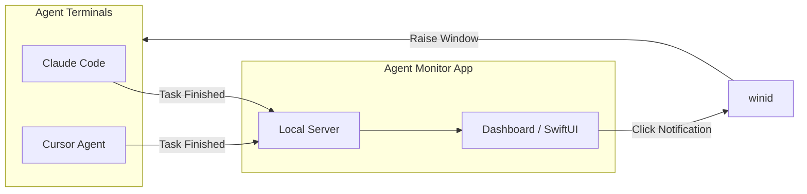

# Agent Monitor (AGM) Overview

**Agent Monitor** centralizes the control of AI agents running in different terminals. By aggregating events from multiple agent flows into one dashboard, it eliminates the need to hunt through tabs—letting you see all activity at a glance and jump straight to the right terminal when an agent needs your attention.

## How it works

At its core, Agent Monitor has three parts working together:

1. **The Ingest (Local Server)**
   The app runs a lightweight HTTP server in the background (on `127.0.0.1`). Whenever an agent finishes a task, a background script (like `notify-post.sh`) sends a quick `POST` request to this server with the details of what it just did.
2. **The Dashboard (macOS App)**
   The server instantly pushes that data to a native macOS window using SwiftUI. You get a clean list of what all your agents are doing, complete with formatting for things like markdown or JSON data.
3. **The Switcher (`winid`)**
   When an agent starts, it registers its terminal tab's unique ID. When you click a notification in the dashboard, the Monitor runs a script (`winid open`) to instantly pull that specific Terminal tab to the front of your screen.

## UI Features

The dashboard is designed to keep you focused on the workflow:

- **Filter by Agent:** Quickly filter the list to only see tasks from Cursor, Claude Code, or standard Terminals.
- **Session Tabs:** At the top of the window, you'll see horizontal tabs for each distinct active session. Clicking one highlights that session's tasks and switches your terminal to it.
- **Hide Responses:** Agent outputs can get long. Use `⌘⇧R` to hide the bulky responses and only see the original requests you sent them.
- **Manual Terminal Triggers:** You can manually paste a terminal ID into the app to create a synthetic "switch target" for a terminal you want to keep an eye on.
- **System Banners:** Optionally get native macOS notification banners when an agent finishes, so you don't even need to be looking at the dashboard.

---

## Technical Architecture

For those diving into the codebase (`Sources/agm/`), here is how the app is structured:

- **`LocalHTTPServer.swift`**: Uses [FlyingFox](https://github.com/swhitty/FlyingFox) to handle the incoming requests.
- **`PanelModel.swift`**: The brain of the app that holds the notifications in memory and handles clearing them or triggering window switches.
- **`ContentView.swift`**: The SwiftUI interface you interact with.
- **`WinidTerminalRunner.swift`**: The bridge that actually runs the shell command to switch your active window.
