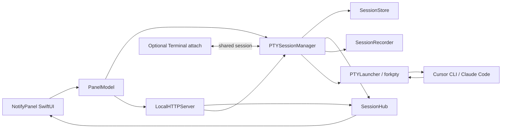

# PTY Launcher Guide

This document explains how to implement a PTY-backed launcher for `NotifyPanel`, why it is worth doing, and where it should fit into the current codebase.

The short version:

- The current app is a notification collector plus session switcher.
- It can focus a saved `Terminal.app` tab and send a completed line into it.
- It cannot truly mirror the live typing area of Cursor CLI or Claude Code, because it does not own the underlying terminal session.
- A PTY launcher fixes that by making the app the owner of the interactive session instead of being a passive observer after the fact.

## Current Architecture

Today the system looks like this:

1. Cursor or Claude Code runs inside `Terminal.app`.
2. `scripts/winid-session-register.sh` stores the session id in `~/.winids/<id>`.
3. `scripts/notify-post.sh` posts a notice to `LocalHTTPServer`.
4. `PanelModel` stores the notice and `ContentView` renders it.
5. `WinidTerminalRunner` shells out to `winid open <id>` when the user wants to jump back to the session.

Relevant files in the current codebase:

- `Sources/NotifyPanel/PanelModel.swift`
- `Sources/NotifyPanel/ContentView.swift`
- `Sources/NotifyPanel/LocalHTTPServer.swift`
- `Sources/NotifyPanel/WinidTerminalRunner.swift`
- `tools/winid`
- `scripts/notify-post.sh`
- `scripts/winid-session-register.sh`

The key limitation is structural: `NotifyPanel` only sees hook events and can target a saved tab by session id. It does not own stdin/stdout for the agent process, so it cannot know the exact in-progress prompt buffer or cursor position.

## Why A PTY Launcher Helps

A PTY launcher makes `NotifyPanel` the source of truth for the interactive session.

Instead of:

- Terminal owns the process
- hooks report what happened later
- the app infers state from notifications and session ids

you get:

- `NotifyPanel` owns the PTY and process lifecycle
- the app sees every byte of output as it happens
- the app can send input directly into the same session
- the UI can reflect the exact live state, not just post-stop summaries

## Benefits

### 1. Real Bidirectional Sync

This is the main reason to do it.

With a PTY-backed session, the GUI can:

- show exactly what the agent is typing or outputting
- send keystrokes or full lines into the same session
- keep the GUI composer and the live session in sync
- support future features like pause, retry, interrupt, and inline command history

With the current hook-driven model, the GUI only knows about completed events.

### 2. Exact Output, Not Reconstructed Output

Today final summaries are collected by reading `transcript_path` after the stop hook. That is better than a fixed string, but it is still a post-processing path.

With PTY ownership, the app can:

- see the raw terminal stream in real time
- preserve ANSI output if desired
- keep an exact session log
- derive summaries from the real session without waiting for a hook

### 3. Better Session Identity

A PTY launcher can generate and own a stable session id at launch time.

That means:

- one session id from creation to exit
- no dependence on `winid session` or shell-specific env fallbacks
- less mismatch between `SessionStart` and `Stop`
- cleaner recovery if the app restarts

### 4. Live Session UX

Once the app owns the PTY, the UI can support:

- terminal preview per session
- session tabs with live unread/output badges
- live input composer
- cancel / interrupt actions
- reconnect to still-running sessions
- replay recent output without depending on Terminal scrollback

### 5. Richer External Clients

The current local server already has the right shape for expansion:

- `GET /api/notifications`
- `POST /api/notify`
- `GET /api/ws`

A PTY session layer would let you add:

- `GET /api/sessions`
- `POST /api/sessions`
- `POST /api/sessions/:id/input`
- `POST /api/sessions/:id/resize`
- `GET /api/sessions/:id/ws`

That enables future browser, mobile, or companion desktop clients.

## Important Constraint

A PTY launcher solves the “app can own the live session” problem.

It does **not automatically solve** the “both the GUI and Terminal.app can be equal interactive clients at the same time” problem.

That distinction matters.

If there is only one true PTY, then there is only one real line editor state. If two independent UIs both try to drive that state naively, they will drift. Shells and REPLs do not provide a high-level synchronization protocol for “current editable line.”

So there are two design choices:

1. `NotifyPanel` becomes the primary interactive surface, and Terminal is secondary or optional.
2. You introduce a multiplexer layer so both GUI and Terminal can attach safely.

## Recommended Architecture

### Recommendation

For a robust system, use:

- a PTY-backed session manager owned by `NotifyPanel`
- an app-facing session API
- an optional attach mechanism for Terminal

For the attach mechanism, there are two viable approaches:

1. A pure custom PTY bridge with your own attach client
2. A `tmux`-backed design where `tmux` is the PTY owner and the app uses control mode

If you want Terminal.app and the GUI to be peers, `tmux` is the more practical production path. If you only need the app to be the canonical interface, a pure PTY launcher is enough.

## Proposed Components

Add these components:

- `PTYSessionManager`
- `PTYSession`
- `PTYLauncher`
- `SessionStore`
- `SessionHub`
- `SessionRecorder`
- `TerminalAttachBridge` (optional)

Suggested file layout:

```text
Sources/
  NotifyPanel/
    PanelModel.swift
    LocalHTTPServer.swift
    ContentView.swift
    ...
    Sessions/
      PTYSessionManager.swift
      PTYSession.swift
      SessionDescriptor.swift
      SessionStore.swift
      SessionHub.swift
      SessionRecorder.swift
  PTYLauncher/
    main.swift
    ForkPTY.swift
    AgentProcessConfig.swift
```

Update `Package.swift` to add:

- either a second executable target `PTYLauncher`
- or a helper target used by `NotifyPanel`

## Architecture Diagram



## Phase 1: Decide Ownership

Before writing code, make one product decision:

### Option A: App Owns Session, Terminal Is Secondary

Use this if:

- the GUI becomes the main interface
- Terminal is mostly for focus or troubleshooting
- you want the simplest PTY implementation

This path is the fastest to build.

### Option B: App And Terminal Must Both Be First-Class

Use this if:

- users must type in Terminal and see the exact same live input in the GUI
- users must type in the GUI and see the same live input in Terminal
- you need concurrent attachment without broken readline state

This path should use a multiplexer, most likely `tmux` control mode.

If you skip the multiplexer and try to fake two-way sync by scraping Terminal text, you will get edge cases around:

- multiline prompts
- shell completion
- cursor movement
- backspace and redraw
- ANSI cursor control
- alternate screen programs

## Phase 2: Build The PTY Core

### Why `forkpty()` Is Better Than Plain `Process`

For interactive CLIs, a real controlling terminal matters.

You can prototype with `openpty()` plus `Process.standardInput/Output/Error`, but production-quality behavior is more reliable with `forkpty()` because it creates the child with a controlling terminal attached.

That matters for:

- prompt rendering
- raw/cooked mode transitions
- line editing
- interactive tools
- signal handling

### PTY Session Lifecycle

Each session should track:

- `sessionId`
- `tool` (`cursor`, `claude`, future custom tool)
- `cwd`
- `env`
- `pid`
- `masterFD`
- `createdAt`
- `status`
- `exitCode`
- `lastActivityAt`
- `title`
- `buffer` or rolling transcript

Pseudo-flow:

1. Generate session id
2. Create PTY
3. Spawn child process under slave side
4. Close slave in parent
5. Read bytes from master
6. Broadcast output
7. Persist rolling history
8. Write input from GUI back to master
9. Watch `waitpid`
10. Mark exit and flush buffers

### Suggested Swift Pseudocode

```swift
final class PTYSession {
    let id: String
    let pid: pid_t
    let masterFD: Int32

    init(config: AgentProcessConfig) throws {
        var master: Int32 = 0
        var slave: Int32 = 0
        guard openpty(&master, &slave, nil, nil, nil) == 0 else {
            throw PTYError.openFailed(errno)
        }

        let pid = forkpty(&master, nil, nil, nil)
        if pid == -1 {
            throw PTYError.forkFailed(errno)
        }

        if pid == 0 {
            execve(config.executable, config.argv, config.envp)
            _exit(127)
        }

        self.id = config.sessionId
        self.pid = pid
        self.masterFD = master
    }
}
```

For a real implementation, wrap the unsafe POSIX pieces in a very small boundary layer.

## Phase 3: Streaming Output

The parent process should read from the PTY master continuously.

Implementation options:

- `DispatchSourceRead`
- dedicated background task with `read()`
- non-blocking FD plus `poll()` or `select()`

For the first implementation, use:

- a rolling byte buffer
- UTF-8 decode best effort for plain text display
- raw byte retention if you want replay or ANSI parsing later

Every output chunk should do three things:

1. Append to an in-memory session buffer
2. Persist to session log storage
3. Broadcast to connected UI clients

## Phase 4: Input Path

The GUI must send input into the same PTY master.

Support these input modes:

- `sendLine(text)` for the current “send and press Return” behavior
- `sendText(bytes)` for raw typing sync
- `sendControl(.interrupt)` for `Ctrl-C`
- `resize(cols, rows)` for terminal geometry

Suggested API:

```swift
protocol SessionInputSink {
    func sendText(_ text: String, to sessionId: String) async throws
    func sendLine(_ text: String, to sessionId: String) async throws
    func sendControl(_ key: ControlKey, to sessionId: String) async throws
    func resize(sessionId: String, cols: Int, rows: Int) async throws
}
```

## Phase 5: Session API In `LocalHTTPServer`

Keep the existing notice routes. Add session routes alongside them.

Suggested endpoints:

- `GET /api/sessions`
- `POST /api/sessions`
- `GET /api/sessions/:id`
- `POST /api/sessions/:id/input`
- `POST /api/sessions/:id/line`
- `POST /api/sessions/:id/resize`
- `POST /api/sessions/:id/signal`
- `GET /api/sessions/:id/ws`

WebSocket session events should include:

- `session_started`
- `session_output`
- `session_input_echo`
- `session_resized`
- `session_exit`
- `session_error`

## Phase 6: UI Changes In `NotifyPanel`

The current `ContentView` is a notice list. A PTY launcher needs a real session surface.

Add:

- a session sidebar or tab strip
- a live terminal output pane
- a dedicated input composer
- session status badges
- interrupt / retry / relaunch actions

Suggested UI split:

- left: session list
- center: live terminal view
- right or lower panel: notices and summaries

This is a better long-term layout than trying to make each notice card act like a full terminal.

## Phase 7: Session Storage

Persist each PTY session to disk so the app can recover metadata and logs after restart.

Suggested store root:

```text
~/.notify-panel/sessions/<session-id>/
  session.json
  output.log
  metadata.json
```

Suggested metadata:

- session id
- tool type
- launch command
- cwd
- start time
- stop time
- exit status
- title
- last known focus target

## Phase 8: Hooks Integration

Once `NotifyPanel` launches the agent itself, hooks become less central for session state.

They still help for:

- notifications from externally launched sessions
- transcript-derived summaries
- compatibility with older workflows

But PTY-managed sessions can emit notices directly without waiting for a stop hook:

1. session exits
2. `PTYSessionManager` records exit state
3. `PanelModel` creates a `Notice`
4. app displays summary and final response

That is cleaner than reconstructing the final state from a hook after the process has already stopped.

## Phase 9: Terminal.app Integration

If you still want a corresponding Terminal window, choose one of these:

### Simple Attach

Open Terminal and run a helper that tails or proxies the session.

This is fine for viewing, but not true peer interaction.

### Multiplexed Attach

Use `tmux` as the real PTY owner and let:

- `NotifyPanel` talk to `tmux` through control mode
- Terminal attach with `tmux attach -t <session>`

This is the best path if both interfaces must stay interactive and synchronized.

### Why `tmux` Control Mode Is Worth Considering

It gives you:

- one authoritative terminal state
- multiple attached clients
- resize handling
- key injection
- pane capture
- reliable attach/detach semantics

If strict “GUI and Terminal must be equal live editors” is a hard requirement, this is usually better than building a custom multi-client PTY stack from scratch.

## Data Model Changes

The current `Notice` model is for completed events. Add a separate session model instead of overloading notices further.

Suggested types:

```swift
struct AgentSession: Identifiable, Codable, Sendable {
    var id: String
    var tool: AgentTool
    var title: String
    var cwd: String
    var status: SessionStatus
    var createdAt: Date
    var updatedAt: Date
    var pid: Int32?
    var lastExitCode: Int32?
    var lastOutputPreview: String?
}

struct SessionOutputChunk: Codable, Sendable {
    var sessionId: String
    var sequence: Int64
    var data: Data
    var utf8Text: String?
    var at: Date
}
```

Keep `Notice` for summaries and alerts. Use `AgentSession` for live interaction.

## Security And Safety

A PTY launcher increases power, so be explicit about boundaries.

Required safeguards:

- localhost-only API by default
- existing bearer token support reused for session endpoints
- explicit environment allowlist for launched tools
- per-session cwd restrictions if needed
- redaction rules before persisting logs
- session idle timeout and cleanup

If a browser client is added later, do not expose raw session control without auth.

## Performance Notes

Watch for:

- large output volume
- ANSI-heavy streams
- high-frequency cursor redraw
- log growth

Recommendations:

- keep rolling in-memory buffers
- persist append-only logs
- batch WebSocket output on a short timer
- avoid decoding the same bytes repeatedly

## Testing Checklist

Test all of these before rollout:

1. Launch Cursor CLI under PTY and verify prompt renders correctly
2. Launch Claude Code under PTY and verify prompt renders correctly
3. Send a normal line from the GUI
4. Type interactively in the GUI and verify output echoes correctly
5. Resize the terminal pane and verify applications respond
6. Press `Ctrl-C` and verify interruption works
7. Run shell completion and arrow-key editing
8. Reconnect the UI while the process is still running
9. Verify logs survive app restart
10. Verify session exit creates the expected final notice
11. Verify auth on new session endpoints
12. Verify behavior when the launched process crashes immediately

## Migration Strategy

Do not replace the current system all at once.

Recommended rollout:

### Stage 1

Add PTY session launching for a new “managed session” flow, while preserving:

- `notify-post.sh`
- `winid-session-register.sh`
- notice list behavior
- `winid open` switching

### Stage 2

Add live session output view in the app.

### Stage 3

Add raw input and interrupt support.

### Stage 4

If needed, add Terminal attach or `tmux` control mode.

### Stage 5

Retire hook-only session management for flows launched from `NotifyPanel`.

## Recommended First Milestone

If you want the smallest meaningful first implementation, build this:

1. Add `PTYSessionManager`
2. Launch one managed Cursor CLI session under PTY
3. Show live output in a dedicated panel
4. Support `sendLine()`
5. Emit a final `Notice` when the process exits

That already delivers the biggest benefit: a real app-owned interactive session.

## Final Recommendation

If the goal is:

- better summaries
- better session control
- live output in the app

then a pure PTY launcher is the right next step.

If the goal is specifically:

- the Mailbox input field and Terminal input field must remain perfectly synchronized
- both the GUI and Terminal must be authoritative live editors

then plan for a PTY launcher **plus** a multiplexer layer, most likely `tmux`.

That is the cleanest way to get true bidirectional sync without fragile Terminal scraping.
